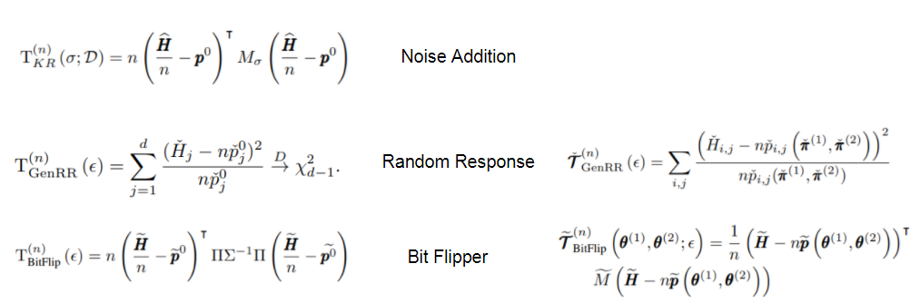
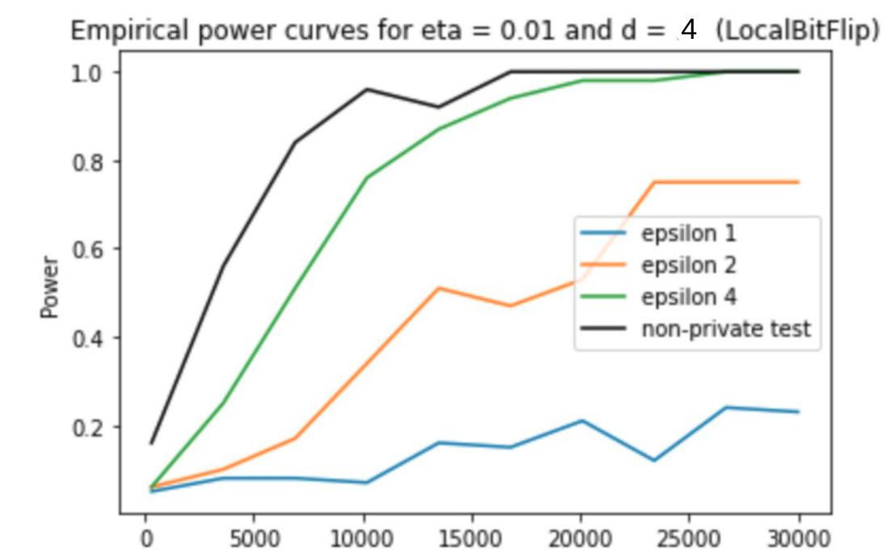
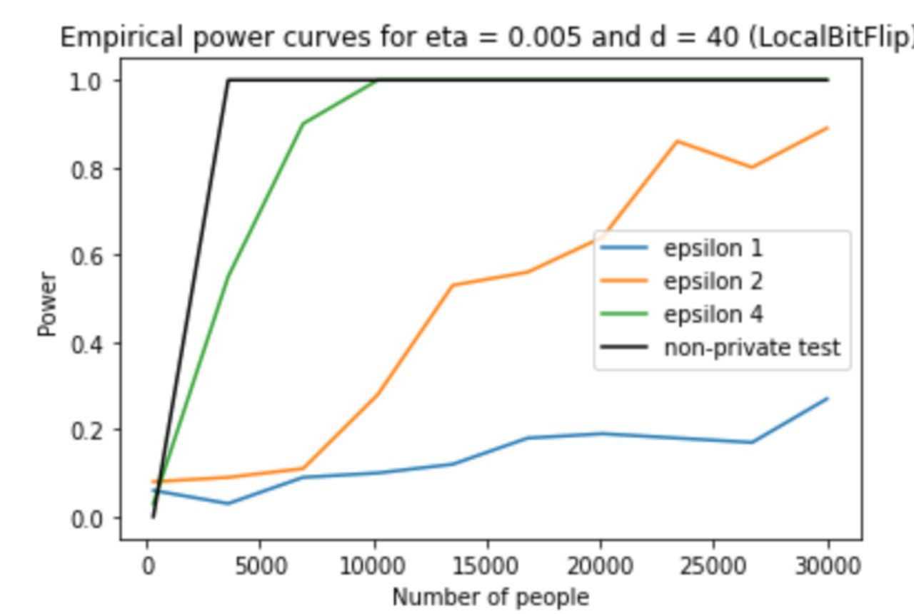
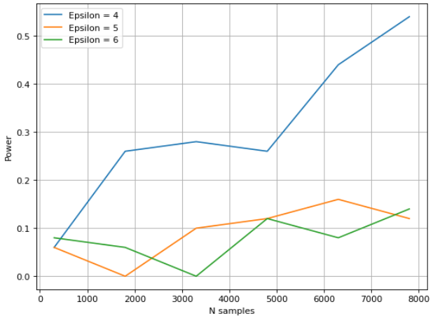

# Local Private Hypothesis Testing

# Intro 
Here, we reproduced some results from the paper and confirmed its conclusions. We explored the design of private hypothesis tests in the local model, where each data entry isperturbed to ensure the privacy of each participant.

Specifically, we analyze locally private chi-square tests for goodness of fit and independence testing.

Original paper: http://proceedings.mlr.press/v80/gaboardi18a/gaboardi18a.pdf

# Problem Statment
The problem, we wanted to solve in this work, is collection and processing of personal information. While dealing with such data, statisticians should provide privacy to the data on the one hand, and also save as many information as possible. 
To solve this problem, usually, some perturbations to the initial data are added. Then, this perturbations should be also counted in statistics for hypothesis testing. This changes my influence the statistical power of the tests. 

In our work we added some changes to the data, and than empirically estimated, how this updates affected the power of statistical tests. 
# Algorithms Ideas 
We tried thee algorythms for perturbation addung: adding noise to the initial data, random response and bit flipper. And on the changed data two differrnt tests were performed: indepenence and goodness of fit test. Below one can see, how the statistics were changed

# Experiments 

## Testing with Bit Flipping.
 We implemented Bit Flip Local Randomizer. Then, we calculated corrected T statistic and found the empirical power of Local DP GOF Test.

## Results

1) Increased amount of traits, d, does not make the test worse. Actually, it improves it.
2) Increased amount of people improves the results of the test.
3) Largest epsilon corresponds to better results of the test. Thus, lower privacy corresponds to better results.

## Indepenence Test With Randomized Response
We wanted to empirically estimate the power of the indepenence test after the pertrbations added. For this goal, we considered H0 to be: U ~ Multinomial(1, p1) and V ~ Multinomial(1, p2) are indepenent. And we generated the data from H1: U ~  Multinomial(1, p1+nu*[1,-1,...-1]),  V ~  Multinomial(1, p1+nu*[1,-1,...-1]), so that H0 is wrong. And than calculated the power of the test as a part of correctly rejected hypothesis. The code can be found in the file IndRR.ipnb

## Results

Here we can see, that the power of the tests increases with the increase of the number of samples. Also, the power increases faster with lower epsilons, because in our experiments, the more the epsilon was, the more private becomes the data. So, it can be seen, that with the raise of privacy the power of the test decreased. 

