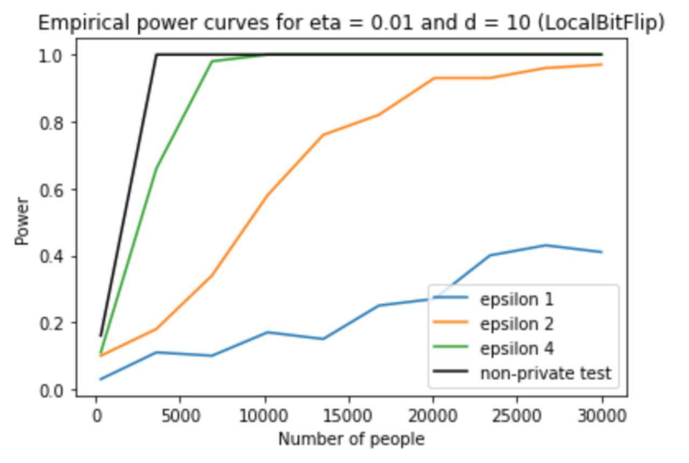

# Local Private Hypothesis Testing

# Intro 
Here, we reproduced some results from the paper and confirmed its conclusions. We explored the design of private hypothesis tests in the local model, where each data entry isperturbed to ensure the privacy of each participant.

Specifically, we analyze locally private chi-square tests for goodness of fit and independence testing.

Original paper: http://proceedings.mlr.press/v80/gaboardi18a/gaboardi18a.pdf

# Experiments 

## Testing with Bit Flipping.
 We implemented Bit Flip Local Randomizer. Then, we calculated corrected T statistic and found the empirical power of Local DP GOF Test.

## Results

1) Increased amount of traits, d, does not make the test worse. Actually, it improves it.
2) Increased amount of people improves the results of the test.
3) Largest epsilon corresponds to better results of the test. Thus, lower privacy corresponds to better results.

## Results

